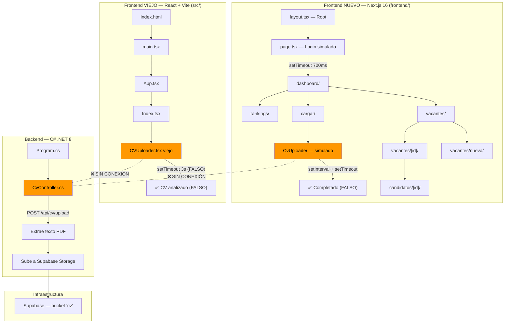

# 🔍 Auditoría Completa — Proyecto HAIRE (v2)

> **Fecha original:** 30 de junio 2026
> **Última actualización:** 1 de julio 2026
> **Repositorio:** `~/dev/HAIRE`
> **Objetivo declarado:** Plataforma de reclutamiento potenciada por IA
> **Estado real:** Dos frontends separados + backend aislado — todo con datos simulados

---

## 1. Origen del Proyecto

El proyecto tiene **dos frontends generados por herramientas de IA distintas**:

| Carpeta | Generador | Evidencia |
|---------|-----------|-----------|
| `src/` (raíz) | **Lovable** (antes GPT Engineer) | `README.md` → "Welcome to your Lovable project", `lovable-tagger` en devDeps, `index.html` → `<title>Lovable App</title>` |
| `frontend/` | **v0 de Vercel** | `.gitignore` → "v0 sandbox internal files", `generator: 'v0.app'` en metadata del layout, `@vercel/analytics` en dependencias |

> [!WARNING]
> **Ahora hay DOS frontends completamente separados en el mismo repositorio.** El original en `src/` (React + Vite, generado por Lovable) y el nuevo en `frontend/` (Next.js 16, generado por v0). No comparten código, dependencias, ni configuración.

---

## 2. Arquitectura General



> [!CAUTION]
> **Ninguno de los dos frontends está conectado al backend.** No existe ningún `fetch`, `axios`, ni llamada HTTP en ninguno de los dos. Son tres piezas completamente aisladas. El nuevo frontend ni siquiera tiene configurado un `NEXT_PUBLIC_API_URL` o similar.

---

## 3. Inventario de Archivos

### 3.1 Frontend NUEVO (Next.js 16 + React 19 + TailwindCSS 4 + shadcn/ui v4)

#### Páginas/Rutas

| Archivo | Líneas | Propósito | Estado |
|---------|--------|-----------|--------|
| [page.tsx](file:///home/antony/dev/HAIRE/frontend/app/page.tsx) | 146 | Login simulado con credenciales hardcodeadas | 🟡 Solo UI — auth falsa |
| [layout.tsx](file:///home/antony/dev/HAIRE/frontend/app/layout.tsx) | 57 | Root layout con Geist font, meta tags, Vercel Analytics | ✅ Funcional |
| [(app)/layout.tsx](file:///home/antony/dev/HAIRE/frontend/app/(app)/layout.tsx) | 6 | Wrapper con AppShell (sidebar + header) | ✅ Funcional |
| [dashboard/page.tsx](file:///home/antony/dev/HAIRE/frontend/app/(app)/dashboard/page.tsx) | 209 | Panel con métricas y tabla de vacantes | 🟡 Datos mock |
| [vacantes/page.tsx](file:///home/antony/dev/HAIRE/frontend/app/(app)/vacantes/page.tsx) | 114 | Grid de cards de vacantes | 🟡 Datos mock |
| [vacantes/nueva/page.tsx](file:///home/antony/dev/HAIRE/frontend/app/(app)/vacantes/nueva/page.tsx) | 216 | Formulario para crear vacante | 🟡 No persiste nada |
| [vacantes/[id]/page.tsx](file:///home/antony/dev/HAIRE/frontend/app/(app)/vacantes/[id]/page.tsx) | 168 | Detalle de vacante con tabs (ranking + cargar) | 🟡 Datos mock |
| [cargar/page.tsx](file:///home/antony/dev/HAIRE/frontend/app/(app)/cargar/page.tsx) | 58 | Página de carga de CVs | 🟡 Solo UI |
| [rankings/page.tsx](file:///home/antony/dev/HAIRE/frontend/app/(app)/rankings/page.tsx) | 57 | Rankings globales por vacante | 🟡 Datos mock |
| [candidatos/[id]/page.tsx](file:///home/antony/dev/HAIRE/frontend/app/(app)/candidatos/[id]/page.tsx) | 198 | Perfil detallado de candidato con score circular | 🟡 Datos mock |

#### Componentes propios (HAIRE)

| Archivo | Líneas | Propósito | Estado |
|---------|--------|-----------|--------|
| [app-shell.tsx](file:///home/antony/dev/HAIRE/frontend/components/haire/app-shell.tsx) | 248 | Sidebar + header + nav mobile + menú usuario + diálogo settings | ✅ Funcional |
| [cv-uploader.tsx](file:///home/antony/dev/HAIRE/frontend/components/haire/cv-uploader.tsx) | 292 | Dropzone multi-archivo con simulación de subida y "análisis IA" | 🔴 Todo simulado |
| [ranking-view.tsx](file:///home/antony/dev/HAIRE/frontend/components/haire/ranking-view.tsx) | 168 | Tabla de ranking + card de recomendación IA | 🟡 Datos mock |
| [score-circle.tsx](file:///home/antony/dev/HAIRE/frontend/components/haire/score-circle.tsx) | 67 | Círculo SVG animado de compatibilidad | ✅ Funcional |
| [score-badge.tsx](file:///home/antony/dev/HAIRE/frontend/components/haire/score-badge.tsx) | 38 | Badge de porcentaje con colores semáforo | ✅ Funcional |
| [logo.tsx](file:///home/antony/dev/HAIRE/frontend/components/haire/logo.tsx) | 26 | Logo de Haire (Sparkles + texto) | ✅ Funcional |
| [page-header.tsx](file:///home/antony/dev/HAIRE/frontend/components/haire/page-header.tsx) | 27 | Header reutilizable con título + acciones | ✅ Funcional |

#### Datos y utilidades

| Archivo | Líneas | Propósito | Estado |
|---------|--------|-----------|--------|
| [mock-data.ts](file:///home/antony/dev/HAIRE/frontend/lib/mock-data.ts) | 362 | 4 vacantes, 10 candidatos, credenciales demo, helpers | 🔴 TODO hardcodeado |
| [utils.ts](file:///home/antony/dev/HAIRE/frontend/lib/utils.ts) | 6 | Función `cn()` para clases Tailwind | ✅ Funcional |

#### Componentes UI (shadcn/ui v4 base-nova)

15 componentes instalados: `avatar`, `badge`, `button`, `card`, `dialog`, `dropdown-menu`, `input`, `label`, `progress`, `separator`, `skeleton`, `switch`, `table`, `textarea`, `tooltip`. **Todos son utilizados** en las páginas — a diferencia del frontend viejo donde 48 de 50 no se usaban.

### 3.2 Frontend VIEJO (React + Vite — sin cambios)

Se mantiene igual que en la auditoría anterior. Ver sección original.

### 3.3 Backend (C# / .NET 8 — sin cambios)

Se mantiene igual que en la auditoría anterior. Ver sección original.

### 3.4 Configuración del Frontend Nuevo

| Archivo | Estado | Notas |
|---------|--------|-------|
| [next.config.mjs](file:///home/antony/dev/HAIRE/frontend/next.config.mjs) | ⚠️ | `ignoreBuildErrors: true` — oculta errores de TypeScript en build |
| [tsconfig.json](file:///home/antony/dev/HAIRE/frontend/tsconfig.json) | ✅ | `strict: true` — mejor que el frontend viejo |
| [components.json](file:///home/antony/dev/HAIRE/frontend/components.json) | ✅ | shadcn/ui v4 con estilo base-nova, RSC habilitado |
| [postcss.config.mjs](file:///home/antony/dev/HAIRE/frontend/postcss.config.mjs) | ✅ | TailwindCSS 4 via PostCSS |
| [.gitignore](file:///home/antony/dev/HAIRE/frontend/.gitignore) | ✅ | Ignora `node_modules`, `.next/`, `.env*.local` |
| [package.json](file:///home/antony/dev/HAIRE/frontend/package.json) | ⚠️ | Nombre genérico `"my-project"`, tiene lockfiles duplicados (npm + pnpm) |

---

## 4. Bugs y Problemas Encontrados

### 🔴 Bug 1 (BACKEND): Código inalcanzable en `Program.cs`

*(Sin cambios respecto a auditoría anterior)* — `app.Run()` es bloqueante, el test de conexión a Supabase después nunca se ejecuta.

### 🔴 Bug 2 (NUEVO): Login sin autenticación real

En [page.tsx](file:///home/antony/dev/HAIRE/frontend/app/page.tsx#L25-L36):

```tsx
// Autenticación simulada
setTimeout(() => {
  if (
    correo.trim().toLowerCase() === CREDENCIALES_DEMO.correo &&
    password === CREDENCIALES_DEMO.password
  ) {
    router.push("/dashboard")
  } else {
    setError(true)
    setCargando(false)
  }
}, 700)
```

Las credenciales están hardcodeadas en `mock-data.ts`: `rodrigo@haire.com` / `haire2026`. No hay sesión, token, ni protección de rutas — cualquiera puede navegar a `/dashboard` directamente.

### 🔴 Bug 3 (NUEVO): CV Uploader sigue siendo falso

En [cv-uploader.tsx](file:///home/antony/dev/HAIRE/frontend/components/haire/cv-uploader.tsx#L114-L155):

```tsx
// Simula subida + análisis con IA de los archivos en cola.
function iniciarAnalisis() {
  // ...usa setInterval para animar progreso, luego setTimeout para "completar"
}
```

La nueva versión es visualmente más sofisticada (progreso animado, estados múltiples), pero sigue siendo 100% simulada. No hay `fetch` ni conexión a ningún backend.

### 🔴 Bug 4 (NUEVO): Formulario de vacante no persiste

En [vacantes/nueva/page.tsx](file:///home/antony/dev/HAIRE/frontend/app/(app)/vacantes/nueva/page.tsx#L66-L69):

```tsx
function guardar() {
  // Simulado: en la demo volvemos al listado de vacantes.
  router.push("/vacantes")
}
```

Al "guardar" una vacante, simplemente redirige. No se crea nada.

### 🟡 Bug 5 (NUEVO): Loading states falsos en todas las páginas

Cada página usa `setTimeout` para simular carga:

- `dashboard/page.tsx` → 600ms
- `vacantes/page.tsx` → 550ms
- `vacantes/[id]/page.tsx` → 500ms
- `candidatos/[id]/page.tsx` → 500ms
- `rankings/page.tsx` → 500ms

No hay datos que cargar — los skeletons son puramente cosméticos.

### 🟡 Bug 6 (NUEVO): `ignoreBuildErrors: true`

En [next.config.mjs](file:///home/antony/dev/HAIRE/frontend/next.config.mjs):

```js
typescript: {
  ignoreBuildErrors: true,
},
```

Esto oculta errores de TypeScript durante el build de producción. Mala práctica.

### 🟡 Bug 7 (NUEVO): Lockfiles duplicados

El frontend tiene `package-lock.json` (npm) Y `pnpm-lock.yaml` (pnpm). Solo debería tener uno. Esto causa confusión sobre qué gestor de paquetes usar.

### 🟡 Bug 8 (NUEVO): Barra de búsqueda decorativa

El `AppShell` tiene un campo de búsqueda "Buscar vacantes o candidatos..." que no hace absolutamente nada. No tiene `onChange`, no filtra, no busca.

### ⚠️ Bug 9: Dos frontends coexistentes

El frontend viejo (Lovable/Vite) en `src/` y el nuevo (v0/Next.js) en `frontend/` coexisten en el mismo repositorio. Esto genera:
- Confusión sobre cuál es el "real"
- Dos `node_modules` (si se instalan ambos)
- Dos `package.json` con dependencias distintas
- Dos `components.json` de shadcn/ui con versiones diferentes

### ⚠️ Bug 10: Nombres inconsistentes (sin cambios)

Ahora son **5** nombres diferentes:
- `.sln` → `NuevoNombre`
- `.csproj` → `cubano`
- Namespace → `CUBANO.Controllers`
- Proyecto → `HAIRE`
- `package.json` raíz → `vite_react_shadcn_ts`
- `package.json` frontend → `my-project`

---

## 5. Seguridad

> [!CAUTION]
> ### Keys de Supabase expuestas (sin cambios)
>
> En [appsettings.json](file:///home/antony/dev/HAIRE/backend/appsettings.json) la anon key sigue commitada al repo.

**Nuevo hallazgo:** Las credenciales demo (`rodrigo@haire.com` / `haire2026`) están hardcodeadas y se muestran en pantalla en el propio login. No hay protección de rutas — todas las rutas `/dashboard`, `/vacantes`, etc. son accesibles sin autenticación.

---

## 6. ¿Tiene IA integrada?

### Respuesta: **NO. Sigue siendo cero integración de IA.**

| Qué se buscó | Frontend viejo | Frontend nuevo | Backend |
|---------------|---------------|----------------|---------|
| OpenAI / Gemini / Claude / Ollama | ❌ | ❌ | ❌ |
| `fetch` / `axios` / llamada HTTP | ❌ | ❌ | N/A |
| Endpoint `/api/ai` o `/api/analyze` | ❌ | ❌ | ❌ |
| Dependencias de ML/NLP | ❌ | ❌ | Solo PdfPig |

El nuevo frontend tiene **más** texto decorativo de IA que el viejo:

- `"Procesando con IA"` — estado del cv-uploader (simulado con `setTimeout`)
- `"Recomendación de la IA"` — card en ranking-view (datos hardcodeados)
- `"Justificación de la IA"` — card en candidato detalle (texto estático)
- `"Iniciar Análisis de IA"` — botón que ejecuta animación falsa
- `"La IA usará estos requisitos para evaluar cada CV"` — texto decorativo
- `"La IA analizará automáticamente el documento"` — texto decorativo

Todas las "justificaciones de IA" y los "porcentajes de compatibilidad" son strings estáticos definidos en [mock-data.ts](file:///home/antony/dev/HAIRE/frontend/lib/mock-data.ts).

---

## 7. Historial de Git

| Fecha | Commit | Autor | Mensaje |
|-------|--------|-------|---------|
| 6 abr 2026 | `e588ca23` | godridrigo233 | `Primer commit de mi backend` |
| 6 abr 2026 | `bbf8f5d9` | godridrigo233 | `correcion` |
| 30 jun 2026 | `b412d450` | Antony | `Refactor: Mover contenido del proyecto a la raíz del repositorio` |
| **1 jul 2026** | **`5c148ec8`** | **Kevin** | **`Frontend`** |

> [!IMPORTANT]
> El commit del nuevo frontend fue hecho por **Kevin** (no por godridrigo233 ni por Antony). Es un commit único con **53 archivos y 13,576 líneas añadidas**, lo cual es consistente con código generado por una herramienta de IA (v0) y copiado al repositorio de una sola vez. El mensaje del commit es simplemente "Frontend".

---

## 8. Métricas del Proyecto

| Métrica | Frontend VIEJO | Frontend NUEVO | Backend |
|---------|---------------|----------------|---------|
| Líneas de código total | ~450 | ~3,600 | ~150 |
| Líneas propias (sin UI lib) | ~270 | ~1,900 | ~150 |
| Páginas/rutas | 2 (`/`, `404`) | 8 (login, dashboard, vacantes, vacantes/nueva, vacantes/[id], cargar, rankings, candidatos/[id]) | 1 endpoint |
| Componentes UI lib | 50 (shadcn v1) | 15 (shadcn v4) | N/A |
| Componentes propios | 2 | 7 | N/A |
| Componentes UI usados | 2 de 50 | 15 de 15 | N/A |
| Tests | 0 reales | 0 | 0 |
| Llamadas a API | 0 | 0 | 1 endpoint |
| Framework | React 18 + Vite 5 | Next.js 16 + React 19 | ASP.NET 8 |
| CSS | TailwindCSS 3 | TailwindCSS 4 | N/A |

---

## 9. Comparativa: Frontend Viejo vs Nuevo

| Aspecto | Viejo (Lovable) | Nuevo (v0) | Veredicto |
|---------|----------------|------------|-----------|
| **Generador** | Lovable (GPT Engineer) | v0 (Vercel) | Ambos generados por IA |
| **Rutas** | 2 | 8 | ✅ Nuevo es mucho más completo |
| **Navegación** | Sin sidebar ni nav | Sidebar completo + nav mobile | ✅ Mejora significativa |
| **Login** | No existe | Simulado con credenciales hardcodeadas | 🟡 Existe pero es falso |
| **Dashboard** | No existe | Con métricas y tabla de vacantes | 🟡 Datos mock |
| **Vacantes** | No existe | CRUD visual (crear + listar + detalle) | 🟡 No persiste datos |
| **Rankings** | No existe | Tabla con scores y recomendación | 🟡 Datos mock |
| **Candidatos** | No existe | Perfil con score circular y habilidades | 🟡 Datos mock |
| **CV Upload** | Dropzone básico (1 archivo) | Dropzone multi-archivo con estados | 🟡 Simulado (mejorado) |
| **Conexión API** | ❌ | ❌ | 🔴 Igual de desconectado |
| **IA real** | ❌ | ❌ | 🔴 Sin cambios |
| **TypeScript** | `strict: false` | `strict: true` | ✅ Mejor configuración |
| **Meta tags** | Dice "Lovable App" | Dice "Haire — Reclutamiento inteligente con IA" | ✅ Personalizado |
| **Design system** | Variables HSL | Variables OKLCH (más moderno) | ✅ Mejor |

---

## 10. Lo que EXISTE vs Lo que FALTA

### ✅ Lo que ya existe (considerando ambos frontends)

1. **Dos scaffolds frontend** completos con distintas tecnologías
2. **Navegación completa** en el frontend nuevo (sidebar, rutas protegidas visualmente)
3. **Design system OKLCH** con tema claro/oscuro, tipografía Geist
4. **8 páginas funcionales** con UI pulida y skeletons de carga
5. **Sistema de rankings** con scores, badges, y círculos de compatibilidad
6. **Formulario de vacantes** con gestión de skills y toggle obligatoria/deseable
7. **CV Uploader mejorado** con drag&drop multi-archivo y estados de progreso
8. **Backend C#** con endpoint de upload y extracción de texto PDF
9. **Integración con Supabase Storage** (solo backend)
10. **Meta tags y SEO** correctamente configurados en el frontend nuevo
11. **Responsive design** con navegación mobile

### ❌ Lo que sigue faltando

| # | Pendiente | Prioridad | Descripción |
|---|-----------|-----------|-------------|
| 1 | **Conectar frontend ↔ backend** | 🔴 Crítica | Sigue sin haber ningún `fetch`. El nuevo frontend tampoco llama al backend |
| 2 | **Integrar un modelo de IA** | 🔴 Crítica | Todos los textos de "IA" son decorativos. Se necesita OpenAI/Gemini/similar |
| 3 | **Base de datos real** | 🔴 Crítica | Todo viene de `mock-data.ts`. No hay tablas en Supabase para vacantes/candidatos |
| 4 | **Autenticación real** | 🔴 Crítica | El login es `setTimeout` + credenciales hardcodeadas. Sin JWT, sin sesiones |
| 5 | **Protección de rutas** | 🟠 Alta | Cualquiera puede navegar a `/dashboard` sin loguearse |
| 6 | **Persistencia de vacantes** | 🟠 Alta | El formulario de "Nueva vacante" no guarda nada |
| 7 | **Upload real de CVs** | 🟠 Alta | El nuevo uploader simula subida con `setInterval` |
| 8 | **Arreglar `Program.cs`** | 🟠 Alta | Código muerto después de `app.Run()` |
| 9 | **Mover keys a `.env`** | 🟠 Alta | Supabase keys hardcodeadas en el repo |
| 10 | **Eliminar frontend viejo** | 🟡 Media | `src/` ya no debería existir si `frontend/` es el nuevo |
| 11 | **Unificar lockfiles** | 🟡 Media | `package-lock.json` + `pnpm-lock.yaml` en frontend |
| 12 | **Quitar `ignoreBuildErrors`** | 🟡 Media | Oculta errores de TypeScript |
| 13 | **Implementar búsqueda** | 🟡 Media | El campo de búsqueda en el header no funciona |
| 14 | **Tests** | 🟡 Media | 0 tests en todo el proyecto |
| 15 | **Unificar nombres** | 🟢 Baja | 6 nombres distintos para el mismo proyecto |

---

## 11. Veredicto Final

> [!WARNING]
> **HAIRE sigue siendo un mockup visual sin funcionalidad real, ahora con un frontend significativamente más completo pero igualmente desconectado.**
>
> El commit del 1 de julio 2026 (por Kevin, generado con v0 de Vercel) añade un frontend Next.js 16 con 8 páginas, navegación completa, y una UI considerablemente más profesional que el frontend original de Lovable. Sin embargo:
>
> - **No hay conexión a ningún backend ni API**
> - **No hay integración de IA real** — todo es texto decorativo y datos hardcodeados
> - **No hay autenticación real** — credenciales en código fuente
> - **No hay persistencia** — todo vive en `mock-data.ts`
> - **Coexisten dos frontends** generados por herramientas de IA diferentes
>
> El proyecto pasó de tener ~450 líneas de código propio a ~2,050 (sumando el nuevo frontend), pero la funcionalidad real sigue siendo la misma: **cero**. Es un prototipo visual más elaborado — una maqueta interactiva de alta fidelidad — pero no un software funcional.

### Resumen de contribuciones por autor

| Autor | Commits | Qué hizo |
|-------|---------|----------|
| **godridrigo233** | 2 (abr 2026) | Backend C# con Supabase (generado parcialmente) |
| **Antony** | 1 (30 jun 2026) | Reestructuración de carpetas |
| **Kevin** | 1 (1 jul 2026) | Frontend Next.js completo (generado con v0 de Vercel) |
